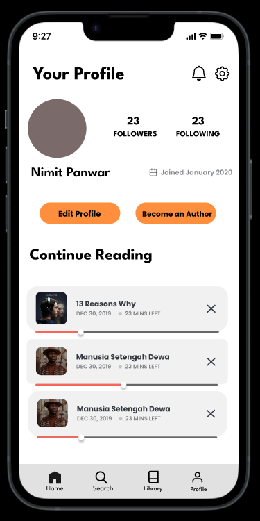

# BookTunes

UI of an audiobook app meant to cater to bibliophiles.  
Done as a course project for IHCI in Monsoon 2022.  
Tools utilised: Canva, Figma and Procreate.

## Low Fidelity Design

## High Fidelity Design

### Some screenshots of the design

|  |  |  |
|:---------------------:|:---------------------:|:---------------------:|
|  |  |  |
|  |  |  |

For complete design, check out: <https://shorturl.at/OilYy>  
For a working prototype with screen navigation, check out : <https://shorturl.at/syKYE>

